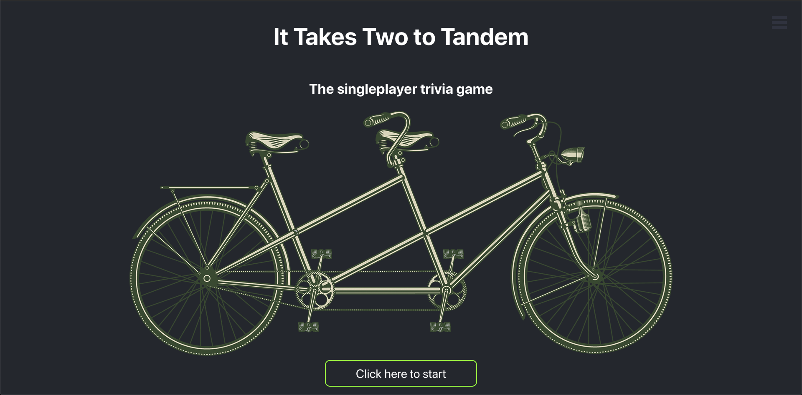
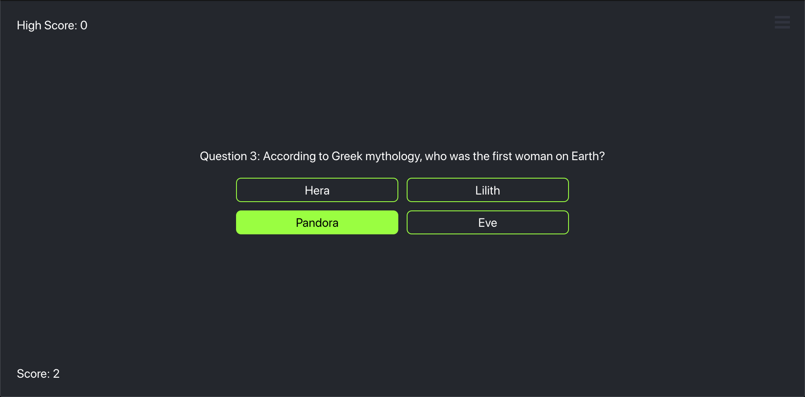
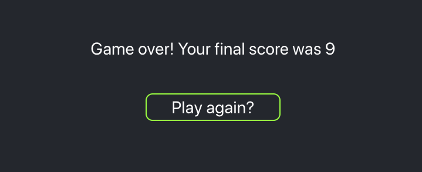

# It Takes Two to Tandem: The singleplayer trivia game



https://tandem-trivia-app.herokuapp.com/ 

To run in Node developement enviornment, download zip or clone repo, change directory to the repo, then in command line run:
```
$ npm install
$ npm start
```

# Technologies
- JavaScript
- React.js
- Node.js
- CSS
- Heroku

# Project Design

It Takes Two to Tandem was built for Tandem's Apprentice Software Engineer program as their coding challenge. The coding challenge's list of assumptions were as follows:

- A round of trivia has 10 Questions
- All Questions are multiple-choice questions
- Your score does not need to update in real time
- Results can update on form submit, button click, or any interaction you choose
- We (Tandem) will provide provide you with the trivia data such as questions, correct and incorrect answers via a JSON file.

# Acceptance Criteria

- A user can view questions.
- Questions with their multiple choice options muct be displayed one at a time.



- Questions should not repeat in a round.
```
import data from "../Apprentice_TandemFor400_Data.json"
...
shuffle(arr){
    for(let i = arr.length - 1; i > 0; i--){
        const j = Math.floor(Math.random() * i)
        const temp = arr[i]
        arr[i] = arr[j]
        arr[j] = temp
    }
    return arr
}
...
class Question extends React.Component {
    constructor(props) {
    ...
    this.index =  0
    this.array = this.shuffle(data).slice(0,10)
    this.data = this.array[this.index]
...
```
- A user can select only 1 answer out of the 4 possible answers.
- The correct answer must be revealed after a user has submitted their answer.


- A user can see the score they received at the end of the round



# Bonus Features
- Enchanced UI responsiveness with button sounds.
```
import correct from "./sounds/correct.mp3"
import wrong from "./sounds/wrong.mp3"
...
onAnswerLIClick(e){
    ...
    let click
    if(e.currentTarget.innerText === this.state.correct){
        plusOne.classList.add("flash")
        click = new Audio(correct)
        click.play()
    }else{
        click = new Audio(wrong)
        click.play()
    }
    ...
render(){
    ...
<ul className="questionPotentialAnswersUL">
    {this.shuffle([...new Set(this.combine(this.state.incorrect, this.state.correct))]).map(answer=> {
        return  <li className="questionAnswerLI"
                    key={answer}
                    onClick={(e) => (this.onAnswerLIClick(e))}>
                    <span>
                        {answer}
                    </span>
                </li>
    })}
</ul>
...
}
```
- CSS animation on game start, answer, and game reset buttons and plus one on correct answer.


- Utilized localStorage to generate a localStorage high score.
- Added bio burger menu with info about the creator.


# Items to work on
- Unit testing

